# dynasafe-interview
this dynasafe interview repo  

## architecture
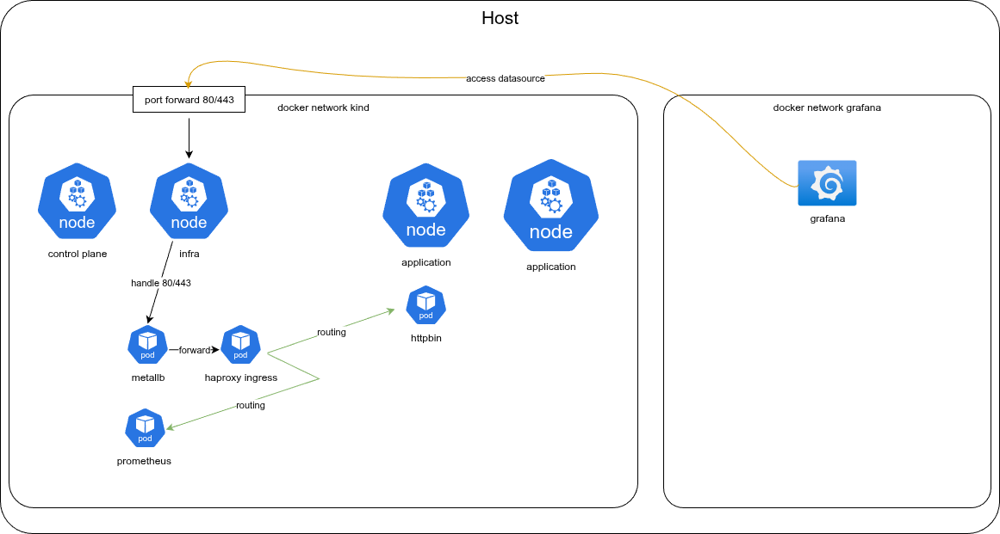

## create cluster

1. [install docker](https://docs.docker.com/engine/install/ubuntu/), for kind  
[install mise](https://mise.jdx.dev/getting-started.html#installing-mise-cli) for runtime manage  

2. install runtime  
config in [mise.toml](mise.toml)
use to install kubectl,helm,kind
```bash
mise install
```

3. create kind cluster  
kind config in [kind/kind-config.yaml](kind/kind-config.yaml)  
in config file define 4 node, all use kubernetes 1.32.5  
- 1 control-plane node 
- 1 work node(infra)  
- 2 work node(application)  

work node add label `role` as node group  
infra node set `extraPortMappings` for docker forward port to work node  

crate cluster by config  
```bash
$ kind create cluster --config kind/kind-config.yaml
Creating cluster "kind" ...
 ✓ Ensuring node image (kindest/node:v1.32.5) 🖼
 ✓ Preparing nodes 📦 📦 📦 📦 📦 📦 📦  
 ✓ Configuring the external load balancer ⚖ 
 ✓ Writing configuration 📜 
 ✓ Starting control-plane 🕹 
 ✓ Installing CNI 🔌 
 ✓ Installing StorageClass 💾 
 ✓ Joining more control-plane nodes 🎮 
 ✓ Joining worker nodes 🚜 
Set kubectl context to "kind-kind"
You can now use your cluster with:

kubectl cluster-info --context kind-kind

Thanks for using kind! 😊
```

4. connect to cluster
export kubeconfig and setup kubectl  
```bash
kind get kubeconfig > kind/kubeconfig.yaml

source <(kubectl completion bash)
complete -o default -F __start_kubectl k
alias k="kubectl"
```

test  
```bash
$ k version
Client Version: v1.32.7
Kustomize Version: v5.5.0
Server Version: v1.32.5
```

5. install metallb  
it's use to implement service type loadbalance  

check infra node ip(INTERNAL-IP)  
```bash
$ k get node --selector='role=infra' -o wide 
NAME          STATUS   ROLES    AGE   VERSION   INTERNAL-IP       EXTERNAL-IP   OS-IMAGE                         KERNEL-VERSION    CONTAINER-RUNTIME
kind-worker   Ready    <none>   20m   v1.32.5   192.168.252.194   <none>        Debian GNU/Linux 12 (bookworm)   6.14.0-1007-oem   containerd://2.1.1
```

check [charts/metallb/IPAddressPool.yaml](charts/metallb/IPAddressPool.yaml) .spec.addresses is setup infra node ip  
if not, update first  
in helm values file [charts/metallb/values.yaml](charts/metallb/values.yaml) set `nodeAffinity` to set speaker is running in infra node  
and config L2 mode  

```bash
helm repo add metallb https://metallb.github.io/metallb
helm install metallb metallb/metallb \
  --version 0.15.2 \
  -f charts/metallb/values.yaml \
  --create-namespace \
  --namespace metallb-system

k apply -f charts/metallb/IPAddressPool.yaml
k apply -f charts/metallb/L2Advertisement.yaml
```

6. install haproxy-ingress  
use haproxy to support ingress feature  
helm value file [charts/haproxy-ingress/values.yaml](charts/haproxy-ingress/values.yaml) setup  
- running in infra node  
- use service type loadbalance to expose ingress controller  
- monitor by prometheus  

```bash
helm repo add haproxytech https://haproxytech.github.io/helm-charts

helm upgrade --install haproxy-kubernetes-ingress haproxytech/kubernetes-ingress \
  --version 1.44.5 \
  -f charts/haproxy-ingress/values.yaml \
  --create-namespace \
  --namespace haproxy-controller
```

## install monitor  
1. install metrics-server for HPA  
helm value file [charts/metrics-server/values.yaml](charts/metrics-server/values.yaml) setup  
- running in infra node  
- ignore tls verify certificate  

```bash
helm repo add metrics-server https://kubernetes-sigs.github.io/metrics-server/
helm upgrade --install metrics-server metrics-server/metrics-server \
  --version 3.12.2 \
  -f charts/metrics-server/values.yaml \
  --create-namespace \
  --namespace kube-system
```

2. install prometheus,node-exporter,kube-state-metrics  
helm value file [charts/prometheus/values.yaml](charts/prometheus/values.yaml) setup  
- running in infra node  
- disable alertmanager (not used)  
- disable prometheus-pushgateway (not used)  
- expose by ingress  

```bash
helm repo add prometheus-community https://prometheus-community.github.io/helm-charts
helm upgrade --install prometheus prometheus-community/prometheus \
  --version 27.28.0 \
  -f charts/prometheus/values.yaml \
  --create-namespace \
  --namespace prometheus
```

test  
```bash
$ curl --resolve prometheus.example.local:80:127.0.0.1 http://prometheus.example.local/-/healthy
Prometheus Server is Healthy.
```

3. monitor etcd  
because etcd cannot configure `listen-metrics-urls` other than 127.0.0.1:2381  
here install a reverse proxy to scrape metric  
etcd use `hostNetwork`, so reverse proxy use `hostNetwork` too can scrape metrics from 127.0.0.1  
```bash
helm upgrade --install etcd-proxy charts/nginx \
  -f charts/nginx/etcd-metrics.yaml \
  --namespace prometheus
```

4. start grafana   
use docker to running grafana, and use provisioning feature to config grafana datasource and dashboard   
```bash
docker compose -f grafana/docker-compose.yml up -d 
```

open http://127.0.0.1:3000 will see grafana is started  
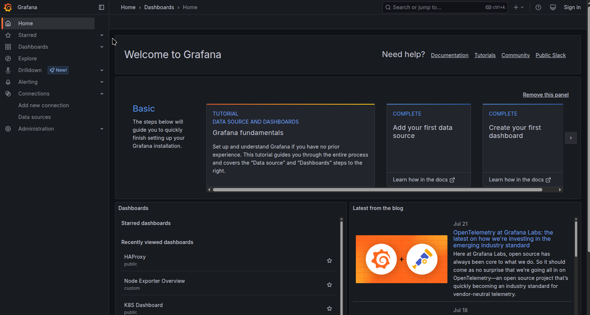

## explain monitor  
dashboard save in 2 folder `public`,`custom`  

public: user shared dashboard  
custom: self-design dashboard  

部份 monitor 因 public dashboard 有非常完整的 panel 並解釋, 因此直接採用不再另外製作 dashboard  
有不滿足需求或無 public dashboard 的才自行製作 dashboard  

因所有 dashbaord panel 眾多, 我只採部份解釋  

### node monitor  
**for detail node monitor**  
[node-exporter-full](http://127.0.0.1:3000/d/rYdddlPWk/node-exporter-full) (metric by 1 node)  
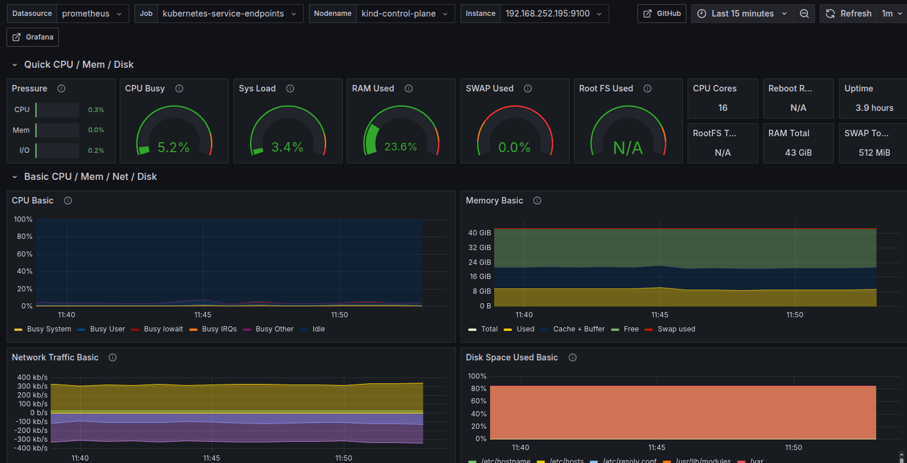  

example system Utilization, Saturation: disk space  
左側顯示可用空間,右側顯示已使用空間  
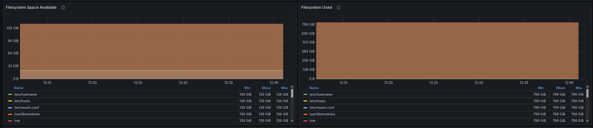  

example system error: OOM-Kill  
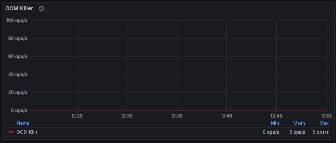  


**for overview node monitor**  
[node-exporter-overview](http://127.0.0.1:3000/d/oJz6m6LVz/node-exporter-overview) (metric by multiple node)  
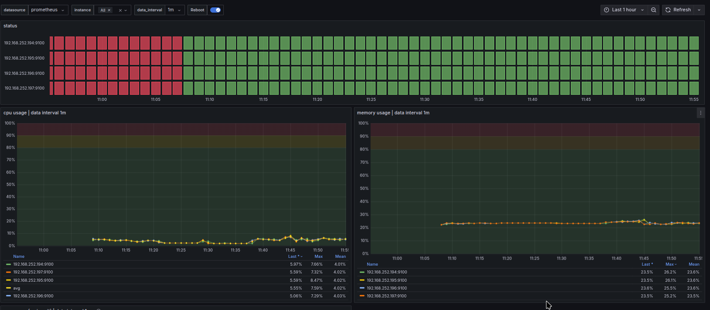  

設計用途 for 針對多個 node 進行 monitor  
只看 cpu/memory/network/disk summary, 避免因 metric 過多造成使用困難  

### kubernetes cluster monitor  
**cluster wide**  
[k8s-dashboard](http://127.0.0.1:3000/d/besllvgck2iv4f/k8s-dashboard)  
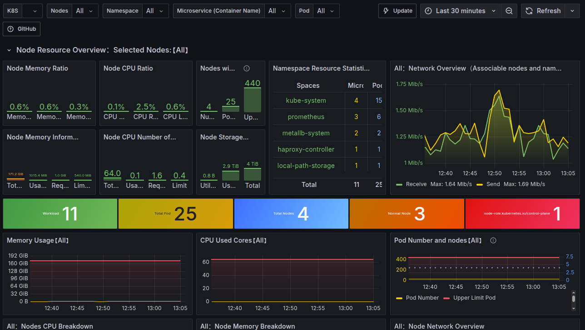  

對 cluster overview 的 monitor 可以看到 resource count  
以及簡易 pod 的 monitor  

**container wide**  
[pod-monitor](http://127.0.0.1:3000/d/b1f2555d-fe63-43fe-b67e-940ade68fdea/pod-monitor)  
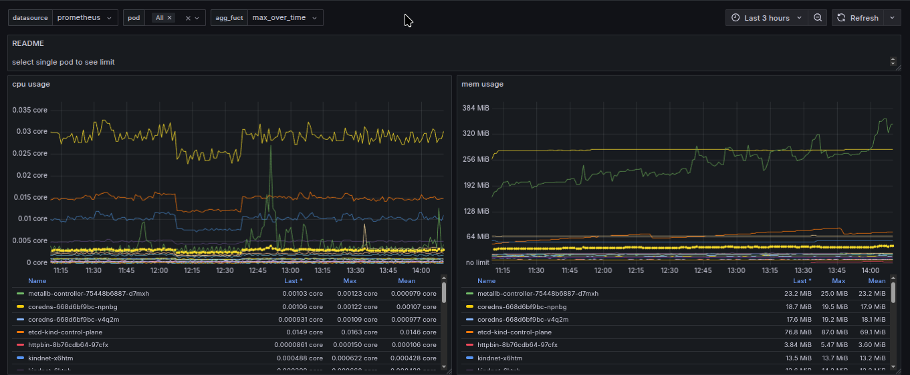

對 container 的 monitor  

設計 select single pod 時能顯示 limit  
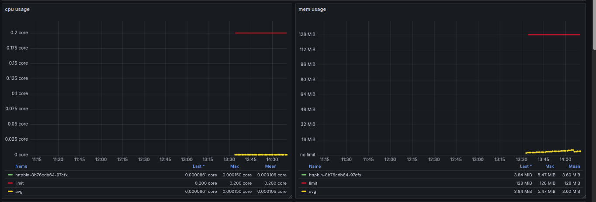

monitor pod cpu throuttling  
監控 Pod 的 CPU 被限制的情況  
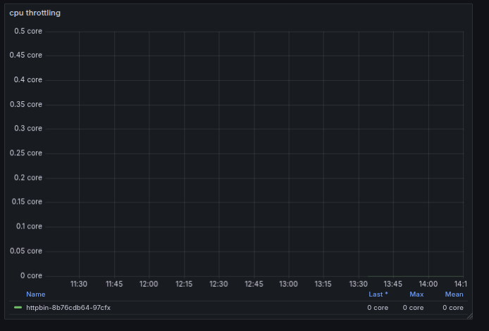

### etcd monitor  
[etcd-cluster-overview](http://127.0.0.1:3000/d/etcd_cluster/etcd-cluster-overview)
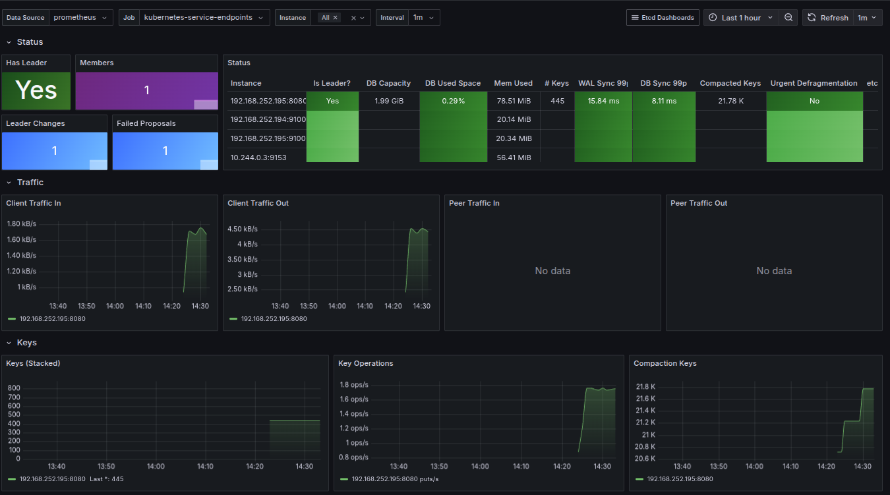

example monitor etcd issue  
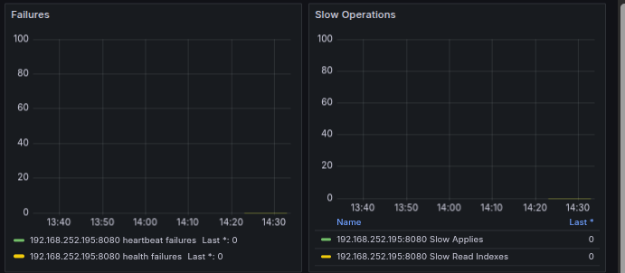  
heartbeat failures: 記錄 etcd 叢集中的 Leader 節點向 Follower 節點傳送心跳訊息失敗的總次數。心跳訊息對於維持 Leader 的領導地位以及讓 Follower 節點確認 Leader 仍然存活  
health failures: 追蹤 etcd 成員自身健康檢查失敗的總次數  

Slow Applies: 記錄 etcd 寫入花費時間過長的次數  
Slow Read Indexes: 記錄 etcd 讀取花費時間過長的次數  

### Prometheus   
[prometheus](http://127.0.0.1:3000/d/PROMETHEUS1/prometheus)
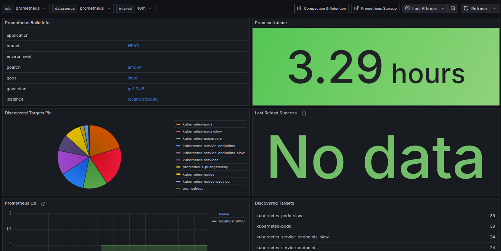


## demo application
use httpbin for demo  
helm value file [charts/httpbin/values.yaml](charts/httpbin/values.yaml) setup  
- running in infra node  
- expose by ingress
- HPA for maxpod 10, cpu use 50%

```bash
helm upgrade --install httpbin charts/httpbin
```

hpa object 
```bash
$ k get hpa
NAME      REFERENCE            TARGETS       MINPODS   MAXPODS   REPLICAS   AGE
httpbin   Deployment/httpbin   cpu: 0%/50%   1         10        1          98m

```

test
```bash
$ curl --resolve httpbin.chart-example.local:80:127.0.0.1 http://httpbin.chart-example.local/ip
{
  "origin": "10.244.1.1"
}
```

## teardown
```bash
docker compose -f grafana/docker-compose.yml down -v 
kind delete cluster -n kind
```